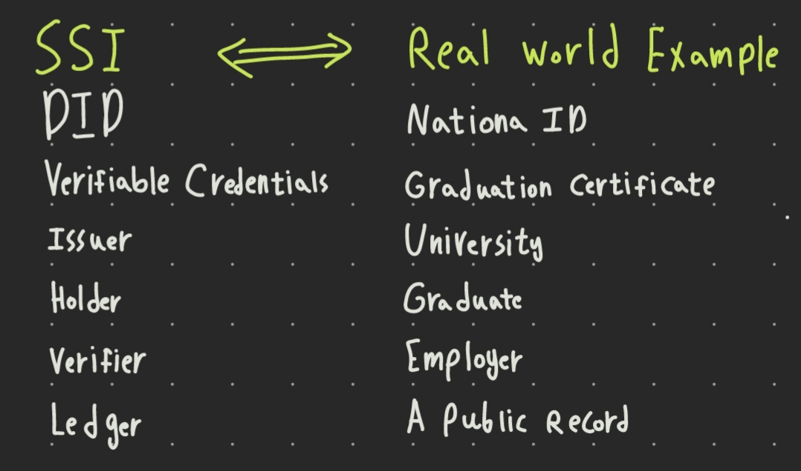
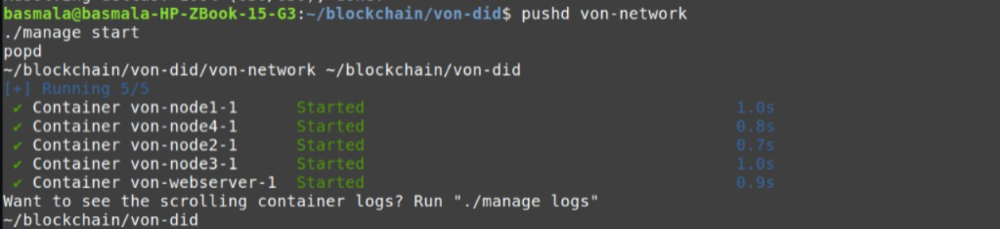
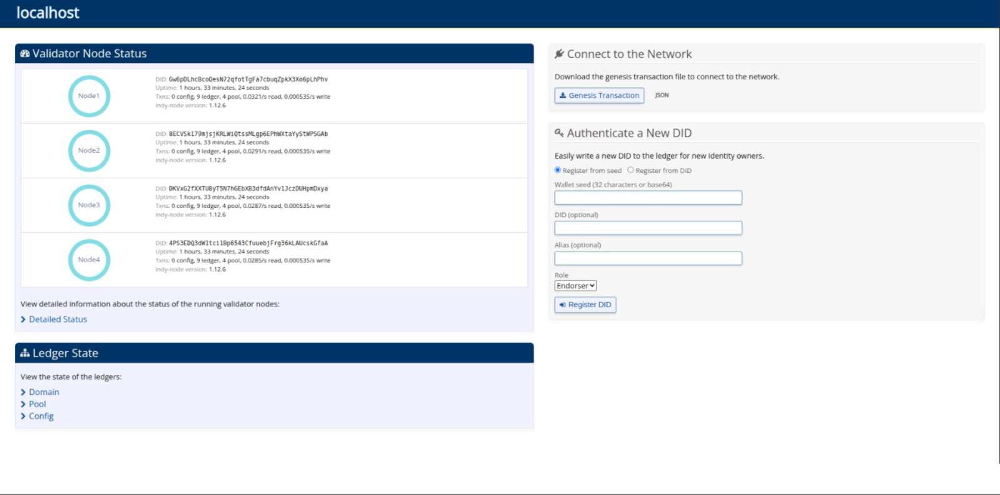
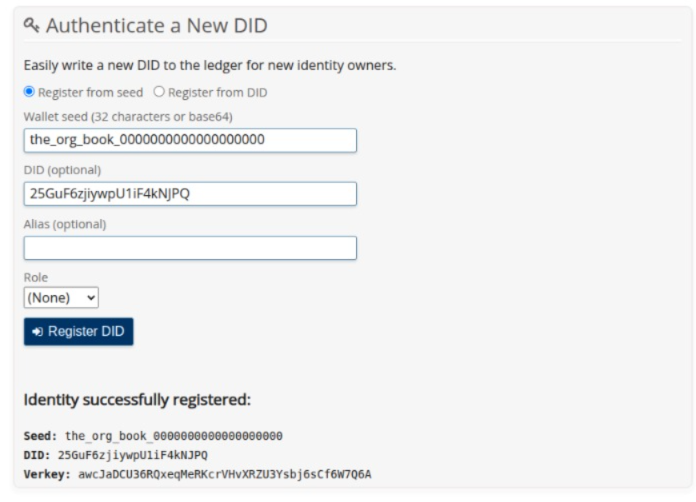
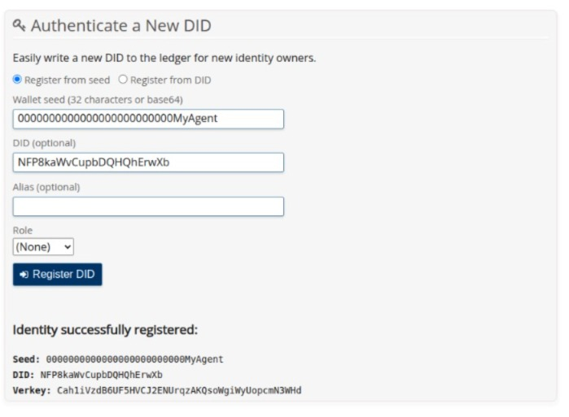
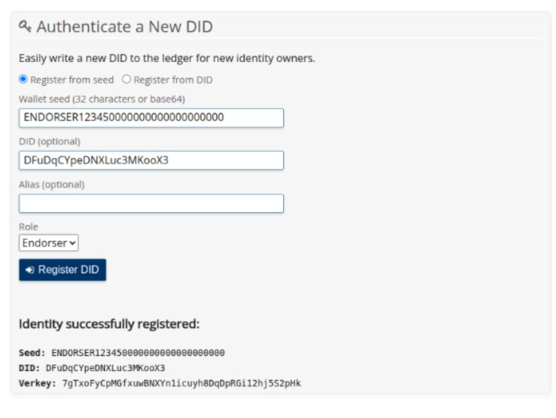
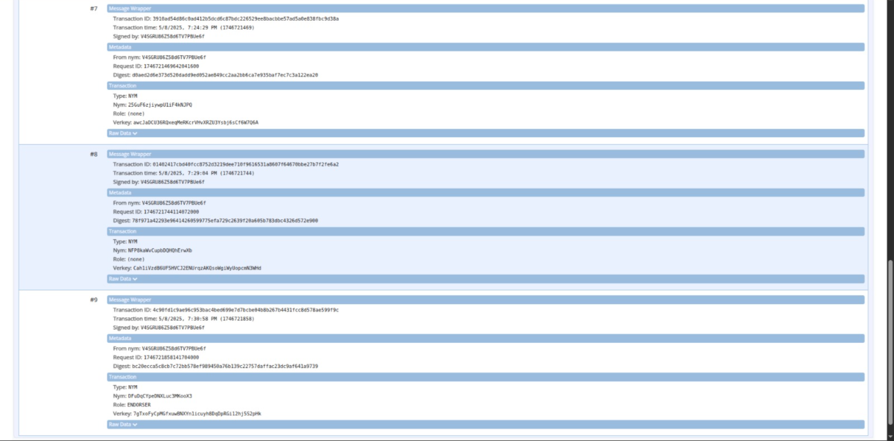
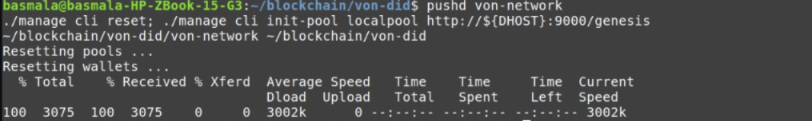
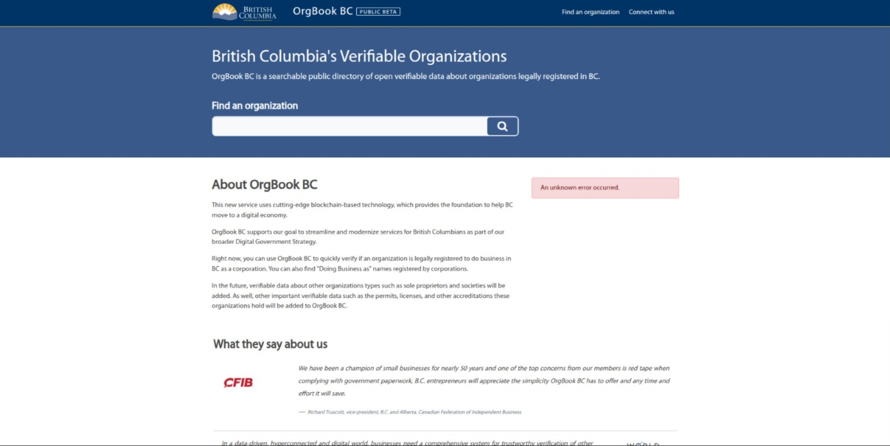

# Introduction
This is my documented walkthrough of the [VON Network Tutorial](https://github.com/bcgov/von-network/blob/main/docs/Writing%20Transactions%20to%20a%20Ledger%20for%20an%20Un-privileged%20Author.md).

First, here is a quick overview of the system I am trying to build:


# Steps
### Start the von network
```
pushd von-network
./manage start
popd
```



visit [http://localhost:9000/](http://localhost:9000/)
<br>

<br>

### Creating DIDs


<br>
<br>

<br>
<br>

<br>

check in domain
<br>

<br>
### Initialize the Indy CLI

<br>
## Start the TheOrgBook
Fix: in `TheOrgBook/docker/docker-compose.yml`
- on line 151 change shcema-spy => schemaspy/schemaspy
- on line 185, change postgresql => postgres
now execute 
- on line 201, change postgresql => postgres

I had other issues, so I installed s2i, and executed 
```
./manage build tob-web
```
in `TheOrgBook/docker` directory.

Then run 
```pushd TheOrgBook/docker
seed=the_org_book_0000000000000000000 AUTO_REGISTER_DID=0 LEDGER_URL=not_used GENESIS_URL=http://${DHOST}:9000/genesis ./manage start

```
now visit [http://localhost:8080](http://localhost:8080/)
<br>

<br>
### Initialize and Start the Issuer Agent
An error occured, I guess from deprecated stuff.